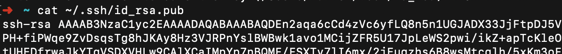
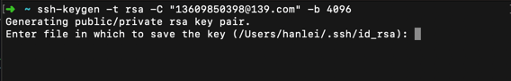
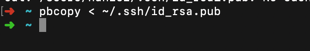
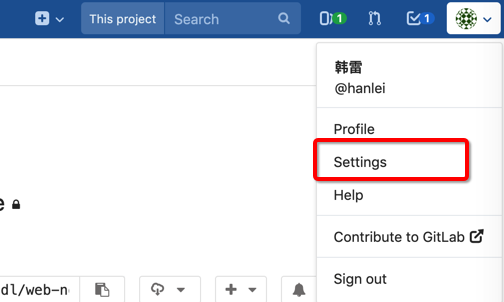
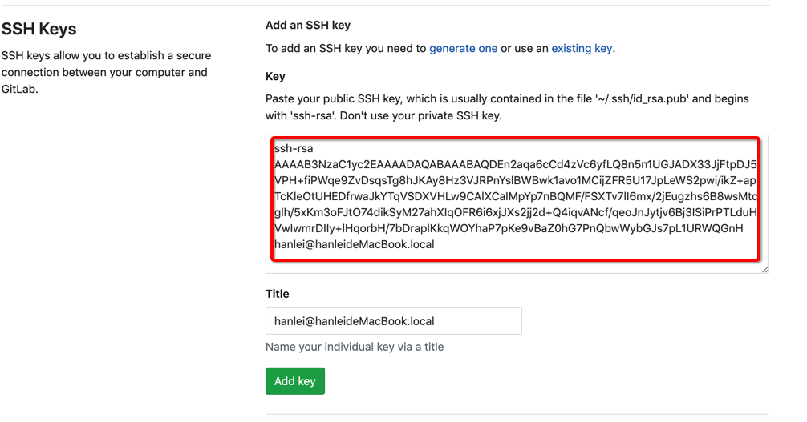
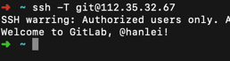

## 开发所需软件

### 1. Git

> 版本管理工具。用于下载项目的代码和在开发时进行代码和文档的版本管理。

  [安装说明](https://git-scm.com/book/zh/v2/%E8%B5%B7%E6%AD%A5-%E5%AE%89%E8%A3%85-Git)

### 2. NodeJS

> 前端项目运行的基础环境。(使用8.x版本)

#### 安装包下载地址

  [Windows 64位](https://nodejs.org/dist/latest-v8.x/node-v8.17.0-x64.msi)
  
  [MacOS](https://nodejs.org/dist/latest-v8.x/node-v8.17.0.pkg)

#### 安装说明
  
  [链接](http://www.runoob.com/nodejs/nodejs-install-setup.html)

#### npm镜像设置

> 解决访问国外官方源服务器过慢的问题

``` bash
// 使用国内镜像
npm config set registry https://registry.npm.taobao.org
// 配置后可通过下面方式来验证是否设置成功
npm config get registry
```

### 3. Yarn

> 用于管理第三方依赖

``` bash
npm install -g yarn
```

### 4. VSCode

> Visual Studio Code (简称 VS Code / VSC) 是一款免费开源的现代化轻量级代码编辑器，用于开发前端页面

  [安装包下载地址](https://code.visualstudio.com/download)
  
#### 开发常用插件安装

  1. 安装 `Settings Sync` 插件(此Guide基于 `Setting Sync 3.4.3版本`)。
  2. 在显示的 `Welcome to Settings Sync` 窗口中点击 `Download Public Gist`按钮并输入 `87043e2ea7694059b4cb19045375ee13`。
  3. 此时插件开始自动进行下载（根据网络情况下载所需时间有所不同，大约需5 ～ 10分钟），在下载成功后自动弹出的对话框中依据提示重新启动VS Code。
  4. VS Code重新启动后，点击左侧扩展菜单项，可查看已启动扩展（Vetur等）

### 5. Github App

> 用于从公司内网Github上传和下载代码

[安装说明](https://w3.ibm.com/help/#/article/github_ent_ibm/github_setup?requestedTopicId=github_ibm)

### 6. Git连接设置

#### MacOS

  1. 打开MacOS的 terminal.app 工具。
  
  2. 输入 `cat ~/.ssh/id_rsa.pub` 确认是否有已经存在的证书。
  > 如果提示存在证书，请跳至 第`5`步。
  
  
  
  3. 输入 `ssh-keygen -t rsa -C "your.mobile@139.com" -b 4096`，并回车，提示的输入项目可以不输入，一路回车。
  > 邮箱建议使用139邮箱。
  
  
  
  4. 输入 `pbcopy < ~/.ssh/id_rsa.pub` 获取证书数据。
  
  
  
  5. 输入 `cd ~/.ssh/` 进入目录，输入 `ls` 查看目录文件。如果存在config文件，使用文本编辑器打开文件，如果不存在则需创建一个config文件。
  
  6. 将下面的内容拷贝至 `config` 文件。
  
  ```bash
  # Git Lab Server 
  Host gitServerIp
    Hostname gitServerIp
    Port 2267
    AddKeysToAgent yes
    UseKeychain yes
    User git
    IdentityFile ~/.ssh/id_rsa
  ```

  7. 通过浏览器访问 [项目Git服务器](http://gitServerIp/)，点击右上角个人图标，选择Settings。
  
  
  
  8. 选择左侧SSH Keys菜单项。
  
  9. 点击key下面的输入框，将在第 `5` 步拷贝的值粘贴入输入框。
  
  
  
  10. 点击 `Add Key` 按钮。
  
  11. 在Terminal内输入 `ssh -T git@gitServerIp`，如果出现Webcome to GitLab则代表SSH设置成功。
  
  
  
#### Windows
  1. 通过 win + R 输入 `powershell` 来打开终端。
  
  2. 输入 `cat ~/.ssh/id_rsa.pub` 确认是否有已经存在的证书。
  > 如果提示存在证书，请跳至 第`5`步。
  
  
  
  3. 输入 `ssh-keygen -t rsa -C "your.mobile@139.com" -b 4096`，并回车，提示的输入项目可以不输入，一路回车。
  > 邮箱建议使用139邮箱。
  
  
  
  4. 输入`cat ~/.ssh/id_rsa.pub | clip` 获取公钥内容。
  
  5. 输入 `cd ~/.ssh/` 进入目录，输入 `ls` 查看目录文件。如果存在config文件，使用文本编辑器打开文件，如果不存在则需创建一个config文件（右键新建文本文档，命名`config`，去掉.txt后缀。
  
  6. 将下面的内容拷贝至 `config` 文件。
  
  ```bash
  # Git Lab Server
  Host gitServerIp
    Hostname gitServerIp
    Port 2267
    AddKeysToAgent yes
    User git
    IdentityFile ~/.ssh/id_rsa
  ```
  7. 通过浏览器访问 [项目Git服务器](http://gitServerIp/)，点击右上角个人图标，选择Settings。
  
  
  
  8. 选择左侧SSH Keys菜单项。
  
  9. 点击key下面的输入框，将在第 `4` 步拷贝的值粘贴入输入框。
  
  
  
  10. 点击 `Add Key` 按钮。
  
  11. 在Terminal内输入 `ssh -T git@gitServerIp`，如果出现Webcome to GitLab则代表SSH设置成功。
  
  