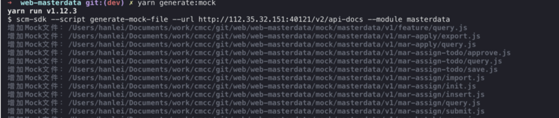
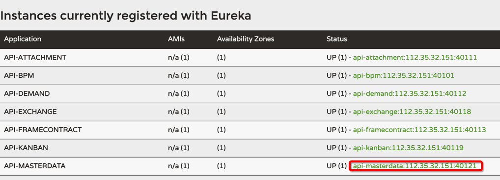
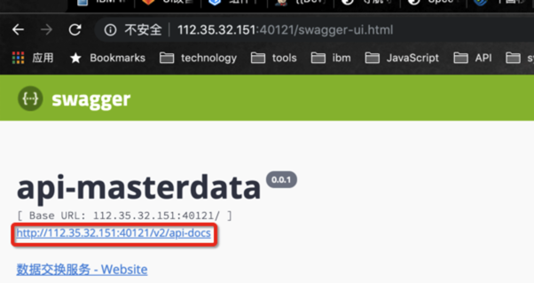

# 提供的脚本一览

## 子模块更新脚本

### 使用方式

1.在 package.json 文件的scripts处定义如下脚本

```json
{
  "upgrade:all-common": "setaria --script update-submodule",
}
```

2.在命令行使用 yarn 或 npm run 命令执行定义的脚本

```batch
yarn upgrade:all-common
```

### 参数说明

| 参数          | 说明            | 可选值                 | 默认值   |
|-------------  |---------------- |---------------------- |-------- |
| branch         |  使用的子模块的分支  | - | master |
| commit         |  更新后是否将最新子模块版本的信息提交到当前git仓库  | - | false |
| init         |  是否为第一次引入子模块  | - | false |
| reset         |  是否重置本地子模块的代码文件  | - | false |

## Mock文件自动生成脚本

> 通过读取在线Swagger的API信息，自动生成与其对应的前端Mock文件。

### 使用方式

1.使用命令行工具进入欲生成Mock文件的前端工程目录

```batch
// 例： cd /Users/hanlei/Documents/work/git/web/web-xxx
cd 前端工程目录
```

2.安装 `swagger-parser-mock` 库

```batch
yarn add swagger-parser-mock --dev
```

3.在package.json文件内添加mock文件生成脚本

> 相关参数请参考下方 参数说明

```json
{
  "scripts": {
    "generate:mock": "setaria --script generate-mock-file --url http://apiInstanceIp/v2/api-docs --module masterdata
  }
}
```

4.在命令行执行创建的脚本

```batch
yarn generate:mock
```

5.脚本执行后可在命令行看到生成的Mock文件



6.使用如下脚本启动前端本地Mock环境

```batch
yarn dev:mock
```

### Swagger API Url的获得方式

1.以开发云环境为例，打开 [开发环境Eureka页面](http://eurekaServerIp/)

2.找到希望生成Mock文件的模块，并点击



3.下图中红框的链接即为该模块API信息



### 参数说明

| 参数          | 说明            | 可选值                 | 默认值   |
|-------------  |---------------- |---------------------- |-------- |
| module         |  模块名称，mock文件会生成到此目录中  | - | - |
| url         |  模块API信息  | - | - |
| output         |  mock文件生成目录  | - | mock/[模块名称] |